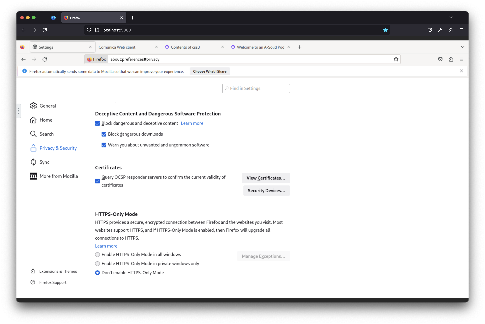
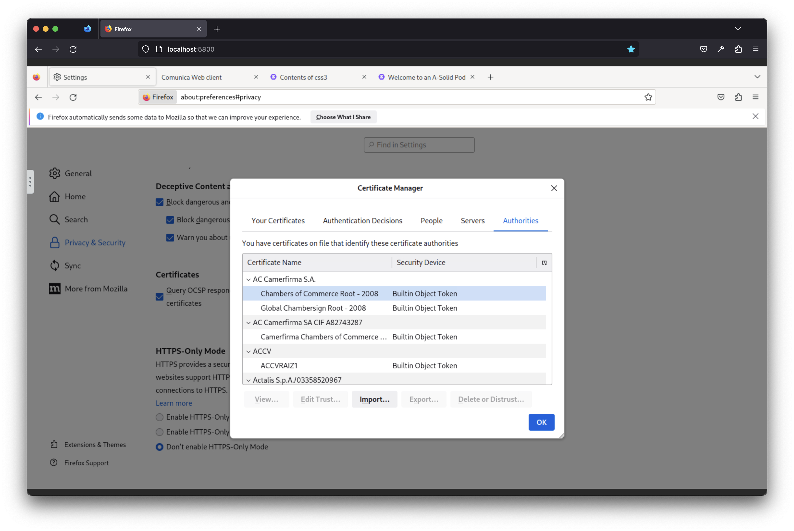
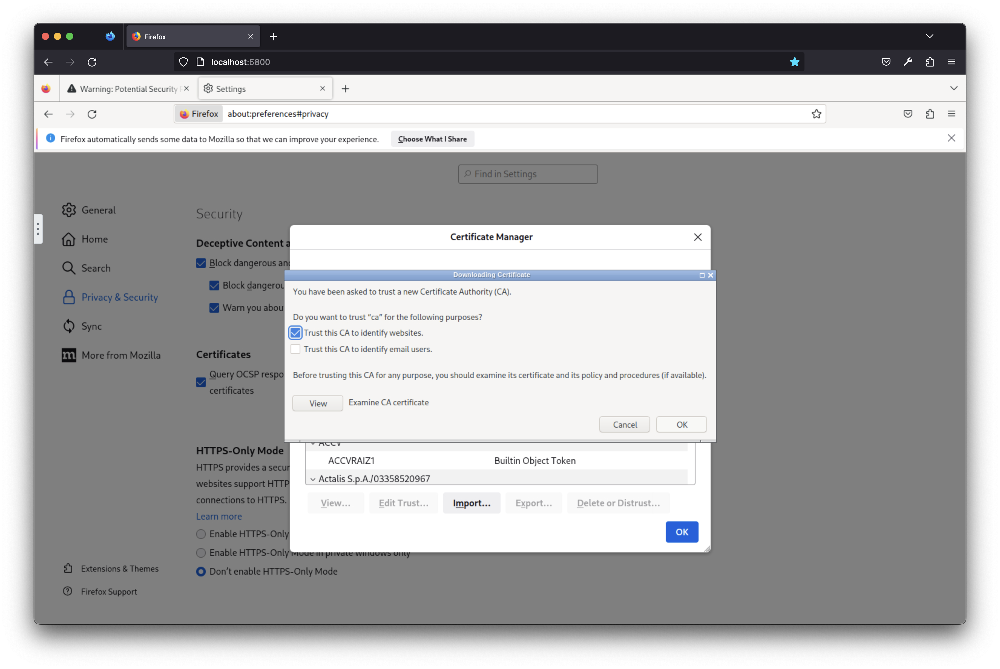
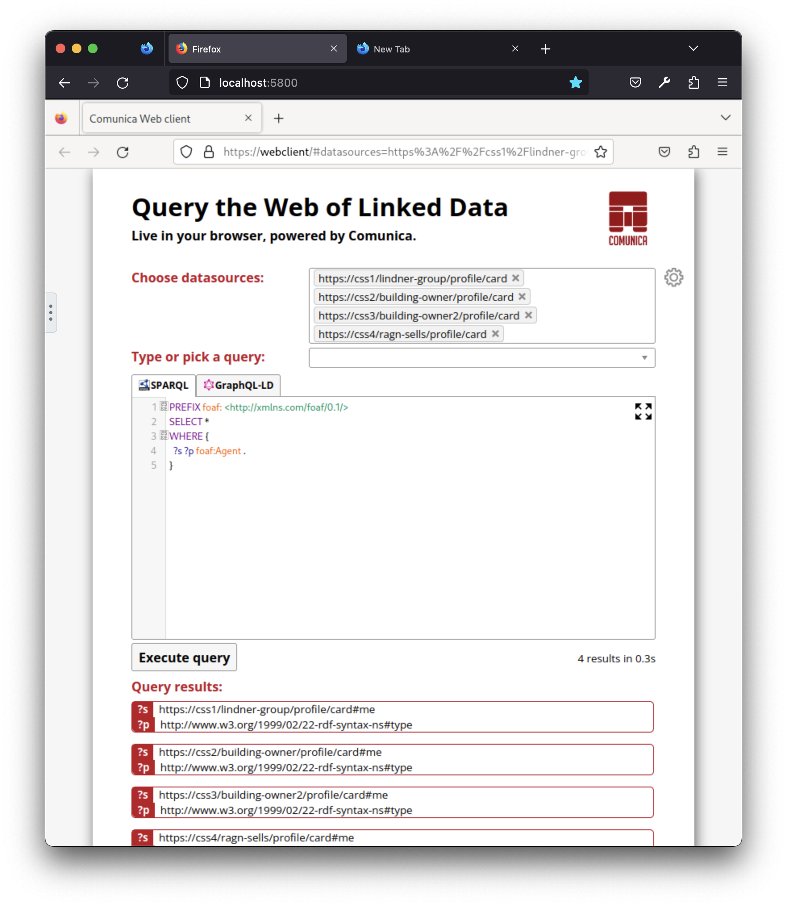

<!-- omit in toc -->
# Architecture

- [Introduction](#introduction)
- [Prerequisites](#prerequisites)
- [Setup](#setup)
  - [General](#general)
  - [Security](#security)
  - [Rebuilding the data viewer](#rebuilding-the-data-viewer)
  - [Docker infrastructure](#docker-infrastructure)
    - [1. Build locally defined images](#1-build-locally-defined-images)
    - [2. Start containers and wait until all's healthy](#2-start-containers-and-wait-until-alls-healthy)
    - [3. Let the Firefox browser trust our self-made Certificate Authority](#3-let-the-firefox-browser-trust-our-self-made-certificate-authority)
    - [4. Use it](#4-use-it)
    - [5. Stop and remove containers](#5-stop-and-remove-containers)
- [Usage](#usage)
  - [Low level querying using a technical Comunica webclient](#low-level-querying-using-a-technical-comunica-webclient)
- [Other documentation resources](#other-documentation-resources)

## Introduction

This repository contains the implementation
of an Open Circularity Platform as part of the Onto-DESIDE Horizon Europe project.</br>
We demonstrate the Open Circularity Platform through some example use cases:
- [example use case within the Construction domain](./doc/construction-use-case.md)
- [example use case within the Textile domain](./doc/textile-use-case.md)

The setup of the Open Circularity Platform is made reproducible by relying on [Docker containers](https://www.docker.com/resources/what-container/) and
[Docker Compose](https://docs.docker.com/compose/) for setting up the network locally
that represents the Solid-based decentralized data sharing platform.

Within the network, we have set up:

- multiple data providers each publishing their data behind a secure access layer using Solid pods,
- a webclient providing a Web UI to execute queries on these Solid pods, and
- a Firefox container providing a means to browse the Solid-based data-sharing platform.
 
During the setup-flow, an administrative user generates and loads all data structured using the Resource Description Framework ([RDF](https://www.w3.org/TR/rdf11-primer/)) into a Solid pod.

During the usage-flow, an end user browses to the emulated Firefox browser (<http://localhost:5800/>)
which provides access to the Solid-based decentralised data-sharing platform.
Within the emulated browser, the user navigates to the Comunica Webclient (<http://webclient>)
which provides a set of predefined queries the user can execute over the Solid pods. 

## Prerequisites

- a bash shell
- Node >= 16 with npm
- [Docker Engine](https://docs.docker.com/engine/) and [Docker Compose](https://docs.docker.com/compose/)
    - Depending on your platform, different installation guides are available from the above links.
- [OpenSSL](https://www.openssl.org/source/)
    - Installation depends on your platform. On Linux (especially on Ubuntu 20.04 LTS), if it is not yet installed, execute `sudo apt install openssl`.
- [yarn classic](https://classic.yarnpkg.com/lang/en/)
 
## Setup

Unless specified otherwise below, execute commands from a bash shell in the repository root.

### General

```bash
# Install dependencies
yarn install
# Setup scripts
# - Download RML Mapper JAR
# - Setup file structure
# - Compile comunica queries
yarn run setup
# Parse YARRRML Mappings to RML & Execute RML Mappings
yarn run dt:mapping:pipeline
```

### Security

To enable HTTPS traffic between every actor within the Docker network,
we generate a public/private keypair, a local Certificate Authority (CA) and a self-signed certificate.

```bash
cd ./scripts/cert
./main.sh # generate certificates
cd ../../
```

### Rebuilding the data viewer
The data viewer is a more friendly webapp to query the data of the use cases.
It consists of static web content.
This static content is added to version control, so normally no action is required.
If it is to be rebuilt/upgraded, the following actions are required.

Start in the current directory (root of this clone).

Clone and select tag of the viewer builder (generic-data-viewer-react-admin) and install it:
```
# will clone in the parent directory of this clone, an assumption of our scripts
pushd ..
git clone git@github.com:SolidLabResearch/generic-data-viewer-react-admin.git
cd generic-data-viewer-react-admin
git checkout ref2-internal
npm install
# come back to the root of this clone
popd
```

Prepare the viewer builder, by providing it links to our input:
```
cd ./scripts/viewer
./prepare.sh
cd ../../
```

Modify our input files if needed...

Build the static content and copy it to its destination location in our repository:
```
cd ./scripts/viewer
./build-and-harvest.sh
cd ../../
```

When finished, the entire generic-data-viewer-react-admin is no longer needed, so you may delete it...

### Docker infrastructure

#### 1. Build locally defined images

Execute:

```bash
docker compose --profile backend --profile frontend build
```

#### 2. Start containers and wait until all's healthy

Execute:

```bash
docker compose --profile backend --profile frontend up --wait
```

Note that the command above may take some time to complete.

Optional: if you're interested in what's happening while the previous command executes, you may open a new terminal window and in it, execute:

```bash
docker compose --profile backend --profile frontend logs -f
```

#### 3. Let the Firefox browser trust our self-made Certificate Authority

The certificate of our Certificate Authority (CA) must be added to the Firefox
browser.
To do this,
open up a browser and navigate to the Firefox container at <http://localhost:5800>.

1. Open up the Firefox Certificate Manager as follows:
   1. Click the "Settings"-button (upper right),
   
   2. Click the "Privacy & Security"-tab (left),
   3. "View Certificates..." (bottom of the page)
   
  
2. Import the certificate of our CA as follows:
   1. Click on the "Import..."-button to open up the file manager
   2. Navigate to "Desktop" (left panel)
   3. Select `ca.cert` and click the "Open"-button (lower right)
   
   4. Check "Trust this CA to identify websites" and click "OK"
   

At this point,
the Solid network can be browsed securely over HTTPS.

#### 4. Use it

Explore the section [Usage](#usage).

#### 5. Stop and remove containers

To stop and remove the containers, execute:
```bash
docker compose --profile backend --profile frontend down -t 0
```

## Usage

### Before continuing

Browse the Docker network through the Firefox container, available from your local browser at <http://localhost:5800>.

### Low level querying using a technical Comunica webclient

To query the Solid pods, open up a tab within the Firefox container's browser and navigate to <https://webclient>.
This Comunica webclient allows you to query both
public and private (if authenticated) data stored within the Solid pods of the
Solid network.

The following screenshot demonstrates querying the `foaf:Agent`s over each actor's Solid pod.


### Higher level querying using a more user friendly data viewer

To use this data viewer, open up a tab within the Firefox container's browser and navigate to <https://viewer:8443>.

The following screenshot shows the result of a query about Texon's components and materials.


## Other documentation resources

- [Overview of actors' WebIDs, emails and passwords](doc/ACTORS_OVERVIEW.md)
- [Overview of permissions](doc/PERMISSIONS_OVERVIEW.md)
- [Testing guide](doc/TESTING.md)
- [Community Solid Server (CSS) configuration](doc/CSS_SETUP.md)
