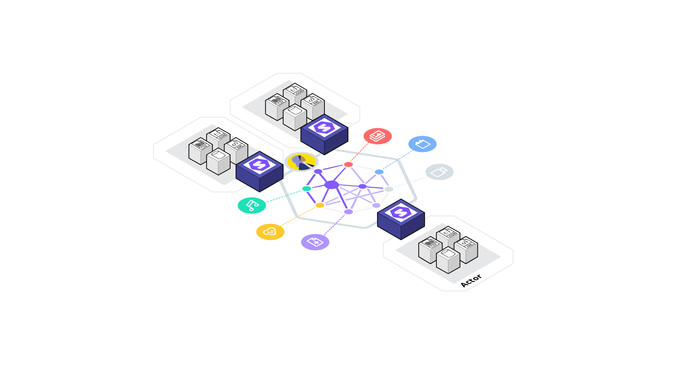

<!-- omit in toc -->
# Architecture

- [Setup](#setup)
  - [Security](#security)
    - [Self-Signed Certificates](#self-signed-certificates)
    - [Firefox browser](#firefox-browser)
- [Usage](#usage)
  - [Query](#query)



## Setup

```bash
# Install dependencies
yarn install
# Download RML Mapper JAR & setup file structure
yarn run dt:setup
# Generate RDF
yarn run dt:mapping:pipeline
```

### Security

To enable HTTPS traffic between every actor within the Docker network,
we generate a public/private keypair and a certificate that is signed by
a local Certificate Authority (CA).

#### Self-Signed Certificates

🚀 Generate self-signed certificates and fire up the services !

```bash
cd ./scripts/cert
./main.sh # generate certificates
cd ../../
docker compose --profile backend --profile frontend up
```

#### Firefox browser

The certificate of our Certificate Authority (CA) must be added to the Firefox
browser.
To do this,
open up a browser and navigate to the Firefox container at <http:localhost5800>.

1. Open up the Firefox Certificate Manager as follows:
   1. Click the the "Settings"-button (upper right),
   
   2. Click the "Privacy & Security"-tab (left),
   3. "View Certificates..." (bottom of the page)
   
  
2. Import the certificate of our CA as follows:
   1. Click on the "Import..."-button to open up the file manager
   2. Navigate to "Desktop" (left panel)
   3. Select `ca.cert` and click the "Open"-button (lower right)
   
   4. Check "Trust this CA to identify websites" and click "OK"
   

At this point,
the Solid network can be browsed securely over HTTPS.

## Usage

### Query

Browse the network through the Firefox container at <http://localhost5800>.

To query the Solid pods,
open up a tab within the Firefox browser and navigate to
<https://webclient>.
This Comunica webclient allows you to query both
public and private (if authenticated) data stored within the Solid pods of the
Solid network.
The following screenshot demonstrates queries the `foaf:Agent`s over each actor's Solid pod.

