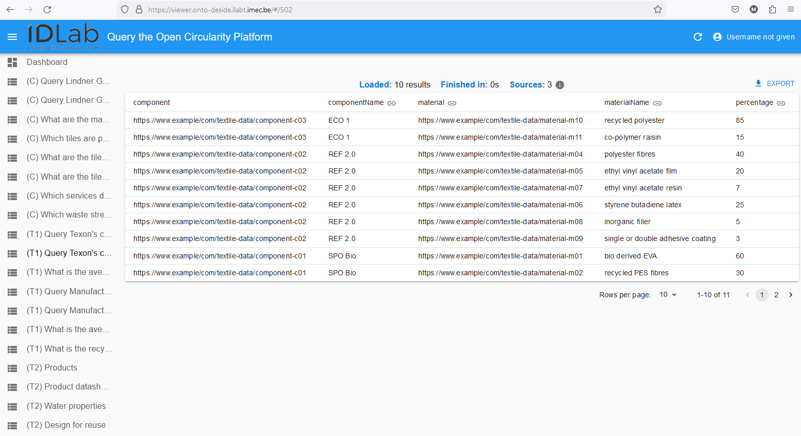

# Architecture

* [Introduction](#introduction)
* [Prerequisites](#prerequisites)
* [Setup](#setup)
  * [General](#general)
    * [Installation](#installation)
    * [Environment variables](#environment-variables)
    * [File templates](#file-templates)
    * [Finalise setup](#finalise-setup)
  * [Security](#security)
  * [Mappings](#mappings)
  * [Building the webclient contents](#building-the-webclient-contents)
  * [Building the data viewer contents](#building-the-data-viewer-contents)
  * [Docker infrastructure](#docker-infrastructure)
    * [1. Start containers and wait until all's healthy](#1-start-containers-and-wait-until-alls-healthy)
    * [2. Make sure the containers survive a system reboot](#2-make-sure-the-containers-survive-a-system-reboot)
    * [3. Let the Firefox browser trust our self-made Certificate Authority](#3-let-the-firefox-browser-trust-our-self-made-certificate-authority)
    * [4. Use it](#4-use-it)
    * [5. Stop and remove containers](#5-stop-and-remove-containers)
  * [Local development infrastructure](#local-development-infrastructure)
    * [1. Start pods](#1-start-pods)
    * [2. Use it](#2-use-it)
    * [3. Stop pods](#3-stop-pods)
* [Usage](#usage)
  * [Before continuing](#before-continuing)
  * [Low level querying using the included technical Comunica webclient](#low-level-querying-using-the-included-technical-comunica-webclient)
    * [Add a Solid pod to the list of datasources for a query](#add-a-solid-pod-to-the-list-of-datasources-for-a-query)
  * [Higher level querying using the included data viewer](#higher-level-querying-using-the-included-data-viewer)
* [Other documentation resources](#other-documentation-resources)

## Introduction

This repository contains the implementation
of an Open Circularity Platform as part of the Onto-DESIDE Horizon Europe project.</br>
We demonstrate the Open Circularity Platform through some example use cases:

* [example use case within the Construction domain](./doc/construction-use-case.md)
* [example use case within the Textile domain](./doc/textile-use-case.md)

The setup of the Open Circularity Platform is made reproducible by relying on [Docker containers](https://www.docker.com/resources/what-container/) and
[Docker Compose](https://docs.docker.com/compose/) for setting up the network locally
that represents the Solid-based decentralized data sharing platform.

Within the network, we have set up:

* multiple data providers each publishing their data behind a secure access layer using Solid pods,
* a webclient providing a Web UI to execute queries on these Solid pods, and
* a Firefox container providing a means to browse the Solid-based data-sharing platform.

During the setup-flow, an administrative user generates and loads all data structured using the Resource Description Framework ([RDF](https://www.w3.org/TR/rdf11-primer/)) into a Solid pod.

During the usage-flow, an end user navigates either to the rather technical Comunica Webclient
which provides a set of predefined queries the user can execute over the Solid pods
or to the generic data viewer, a more user-friendly web application that works with the same underlying predefined queries.

> A **public deployment** is available. To use it as is, no further setup is needed, so continue reading at [Usage](#usage) and choose *Selected setup = Public deployment*.

## Prerequisites

* a bash shell
* Node >= 16 with npm
* [Docker Engine](https://docs.docker.com/engine/) and [Docker Compose](https://docs.docker.com/compose/)
  * Depending on your platform, different installation guides are available from the above links.
* [OpenSSL](https://www.openssl.org/source/)
  * Installation depends on your platform. On Linux (especially on Ubuntu 20.04 LTS), if it is not yet installed, execute `sudo apt install openssl`.
* [yarn classic](https://classic.yarnpkg.com/lang/en/)

## Setup

Unless specified otherwise below, execute commands from a bash shell in the **repository root**.

### General

#### Installation

```bash
# Install dependencies
yarn install
```

#### Environment variables

The files in this repository were prepared to generate output for three different selected setups.
The selection of a selected setup is done by means of environment variables.
These environment variables are assigned in *environment variables files*.

An overview:

| Selected setup                                   | Details                                                                                                                             | Environment variables file | Docker based |
|--------------------------------------------------|-------------------------------------------------------------------------------------------------------------------------------------|----------------------------|--------------|
| Development and stand-alone demo                 | URLS `https://...`, same as in [envvars2](envvars2), but nothing publicly accessible (use included webapps via included browser)    | [envvars](envvars)         | yes          |
| Public deployment                                | URLS `https://...`, publicly accessible pods and included webapps, open for external webapps                                        | [envvars2](envvars2)       | yes          |
| Local development                                | URLs `http://localhost:...`, pods running on the local host, webapps not included, open for local webapps                           | [envvars3](envvars3)       | no           |

In any new bash shell, before executing any of the commands in this Setup section and in the other sections,
first assign the environment variables using the appropriate environment variables file:

```bash
# example for file 'envvars2'
source envvars2
```

For a closer look at the different selected setups, see [here](doc/SELECTED_SETUPS.md).

#### File templates

Unless you just started from a freshly cloned repo, get rid of previous derived files:

```bash
# show them (in cause you're doubting)
git ls-files --others --ignored --exclude-standard | grep -v -e '^node_modules/' -e '^\.idea' -e '^rmlmapper.jar'
```

```bash
# delete them
git ls-files --others --ignored --exclude-standard | grep -v -e '^node_modules/' -e '^\.idea' -e '^rmlmapper.jar' | xargs -r -I % rm %
```

Create derived files from their templates:

```bash
./scripts/templates/apply-templates.sh
```

#### Finalise setup

Next setup script executes:

* download RML Mapper JAR
* setup file structure.

```bash
yarn run setup
```

### Security

To enable HTTPS traffic between every actor within the Docker network,
we generate a public/private keypair, a local Certificate Authority (CA) and a self-signed certificate.

> Note: this step is only needed in case of environment variables file *envvars*.

```bash
cd ./scripts/cert && bash ./main.sh && cd ../../
```

### Mappings

Parse YARRRML Mappings to RML & Execute RML Mappings:

```bash
yarn run dt:mapping:pipeline
```

### Building the webclient contents

Collect queries:

```bash
yarn run comunica:queries:setup
```

### Building the data viewer contents

The following command will:

* clone and select the appropriate tag of the [Generic data viewer builder](<https://github.com/SolidLabResearch/generic-data-viewer-react-admin>) and install it;
* prepare the viewer's static content builder by providing it our input;
* build the static content;
* harvest the static content into our directory structure.

You may need to give your ssh private key password during next:

```bash
cd ./scripts/viewer && ./build-webclient-contents.sh && cd ../../
```

### Docker infrastructure

> Skip this section if not in a Docker based setup.

#### 1. Start containers and wait until all's healthy

Execute...

either:

```bash
yarn run dc:up
```

or (including the extra pods):

```bash
yarn run dc:upx
```

Note that the commands above may take some time to complete.

Optional: if you're interested in what's happening while the previous command executes, you may open a new terminal window and in it, execute:

Execute...

either:

```bash
yarn run dc:logs
```

or (including the extra pods):

```bash
yarn run dc:logsx
```

#### 2. Make sure the containers survive a system reboot

This step is optional; you may want to do this on a server deployment.

Execute (see below for crontab file contents to be added):

```bash
crontab -e
```

Crontab contents to be added:

```bash
SHELL=/bin/bash
PATH=/usr/local/sbin:/usr/local/bin:/sbin:/bin:/usr/sbin:/usr/bin
@reboot sleep 60 && cd /full/path/to/your/cloned/architecture/ && source envvarsx && docker compose --profile backend --profile frontend --profile extra-pod restart
```

where:

* you replace `/full/path/to/your/cloned/architecture/` with the full path to where you cloned this repository
* you replace `envvarsx` with the applicable environment variables file
* you adapt the docker compose command `--profile` options in line with your chosen `yarn run ...` command in step 1; the example shown is valid for `yarn run dc:upx`

#### 3. Let the Firefox browser trust our self-made Certificate Authority

> Note: this step is only needed in case of environment variables file *envvars*.

Follow the instructions in [the Setup section of FIREFOX_CONTAINER.md](doc/FIREFOX_CONTAINER.md#setup).

#### 4. Use it

Explore the section [Usage](#usage).

#### 5. Stop and remove containers

To stop and remove the containers, execute:

either:

```bash
yarn run dc:down
```

or (including the extra pods):

```bash
yarn run dc:downx
```

If you added crontab lines in step 2, remove them now.

### Local development infrastructure

> Skip this section if in a Docker based setup.

#### 1. Start pods

Execute...

```bash
./scripts/local-run/start-csss.sh
```

Note that the command above starts the pods in the background. This takes some time to complete.
The pods are listening as soon as they report so in their respective logfiles at `./local-run/*.log`.

The pods data can be sniffed at `./local-run/data/css*/`.

#### 2. Use it

Explore the section [Usage](#usage).

#### 3. Stop pods

Execute:

```bash
yarn run dc:down
```

## Usage

### Before continuing

Some queries may require you to login as one of the actors, described in the use cases.
That is because read permissions to resources may be restricted to specific actors, as can be seen in the [overview of permissions](doc/PERMISSIONS_OVERVIEW.md).  
Find actors' email addresses and passwords in the [overview of actors' WebIDs, emails and passwords](doc/ACTORS_OVERVIEW.md).

### Low level querying using the included technical Comunica webclient

To query the Solid pods, navigate to the URL configured for the webclient:

| Selected setup                                   | Included technical Comunica webclient URL      | Browse via                                            |
|--------------------------------------------------|------------------------------------------------|-------------------------------------------------------|
| Development and stand-alone demo                 | <https://webclient.onto-deside.ilabt.imec.be/> | Included Firefox container at <http://localhost:5800> |
| Public deployment                                | <https://webclient.onto-deside.ilabt.imec.be/> | Your local browser                                    |
| Local development                                | Not available; do it yourself if needed (1)    | Your local browser                                    |

(1) The queries as used in other setups are prepared for you in `./scripts/comunica/outputs/queriesgi/`.

This Comunica webclient allows you to query both public and private (if authenticated) data stored within
the Solid pods of the Solid network.

The following screenshot demonstrates querying Lindner Group's products. The result shown was obtained when logged in to identity provider `https://css1.onto-deside.ilabt.imec.be` as `info@lindner-group.com`.


#### Add a Solid pod to the list of datasources for a query

All queries are configured to work on a predefined list of datasources (Solid pods in our case). Selecting a query preloads the *Choose datasources:* dialogue.

In the public deployment setup case, it is possible to your Solid pod to the list.
See also [Public deployment with additional external Solid pods](doc/SELECTED_SETUPS.md#public-deployment-with-additional-external-solid-pods).

If you don't have a pod yet:

* you can obtain one following the [Solid project instructions](https://solidproject.org/users/get-a-pod)
* or [try out Solid pods with the SolidLab Pod Playground](https://solidlabresearch.github.io/documentation-center/getting-started/#try-out-solid-pods-with-the-solidlab-pod-playground)
  (be warned for this one: *"The pods and data on the instance is removed daily and there are no guarantees regarding uptime."*).

To add an external Solid pod to the list of datasources in the Comunica webclient, place the cursor in that dialogue:


Next type the baseURL of an additional Solid pod and confirm with the `<Return>` key:


The additional datasource will be taken into account when the query is executed, and the datasource will be available as a *preset datasource* from here on.

### Higher level querying using the included data viewer

To use this data viewer, navigate to the URL configured for the data viewer:

| Selected setup                                   | Included data viewer URL                    | Browse via                                            |
|--------------------------------------------------|---------------------------------------------|-------------------------------------------------------|
| Development and stand-alone demo                 | <https://viewer.onto-deside.ilabt.imec.be/> | Included Firefox container at <http://localhost:5800> |
| Public deployment                                | <https://viewer.onto-deside.ilabt.imec.be/> | Your local browser                                    |
| Local development                                | Not available; do it yourself if needed (1) | Your local browser                                    |

(1) A version as used in the other setups is ready for you in `../generic-data-viewer-react-admin/` as a result of [building the data viewer contents](#building-the-data-viewer-contents).
Go to that directory, spin it up with `npm run dev` and browse the URL it reports to use it.

The following screenshot shows the result of a query about Texon's components and materials. The result shown was obtained when logged in to identity provider `https://css5.onto-deside.ilabt.imec.be` as `info@texon.com`.



## Other documentation resources

* [Overview of actors' WebIDs, emails and passwords](doc/ACTORS_OVERVIEW.md)
* [Overview of permissions](doc/PERMISSIONS_OVERVIEW.md)
* [About the different selected setups](doc/SELECTED_SETUPS.md)
* [Testing guide](doc/TESTING.md)
* [Community Solid Server (CSS) configuration](doc/CSS_SETUP.md)
* [The Firefox container](doc/FIREFOX_CONTAINER.md)
* [Developer documentation](doc/DEVELOPERS.md)
