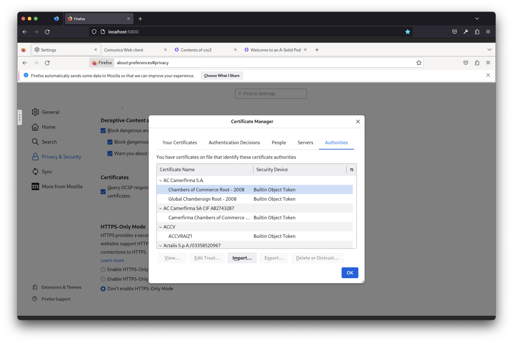

# The Firefox container

A firefox browser in a container is added to Docker compose environments that are not suited to be accessed from an external browser.

## Setup 

The certificate of our Certificate Authority (CA) must be added to the Firefox
browser. To do this, open up a browser and navigate to the Firefox container at <http://localhost:5800>.

1. Open up the Firefox Certificate Manager as follows:
    1. Click the "Settings"-button (upper right),
       
    2. Click the "Privacy & Security"-tab (left),
    3. "View Certificates..." (bottom of the page)
       

2. Import the certificate of our CA as follows:
    1. Click on the "Import..."-button to open up the file manager
    2. Navigate to "Desktop" (left panel)
    3. Select `ca.crt` and click the "Open"-button (lower right)
       
    4. Check "Trust this CA to identify websites" and click "OK"
       

At this point,
the Solid network can be browsed securely over HTTPS.
