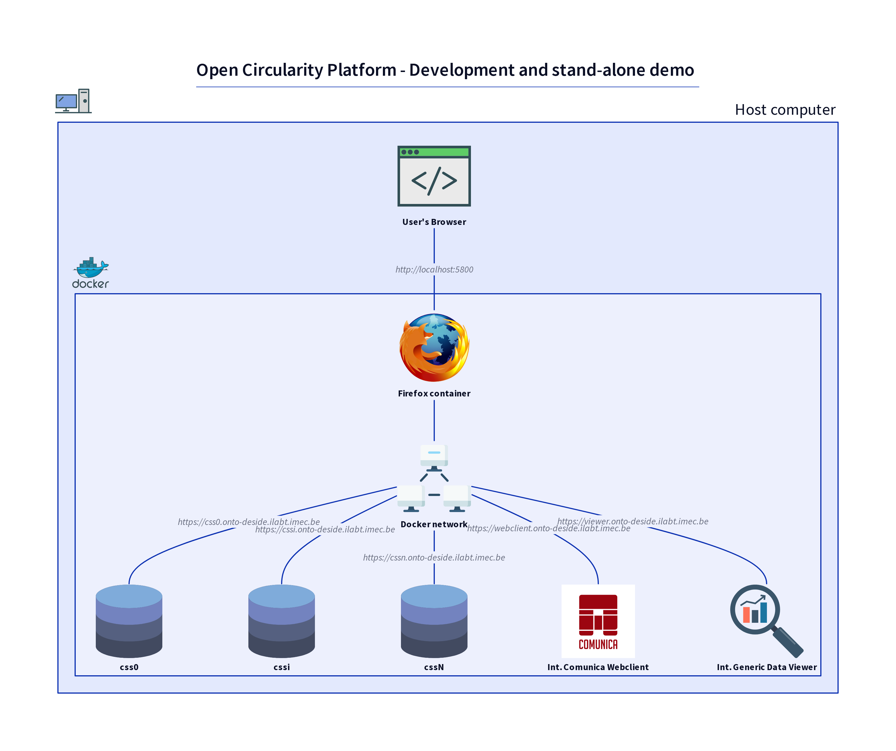
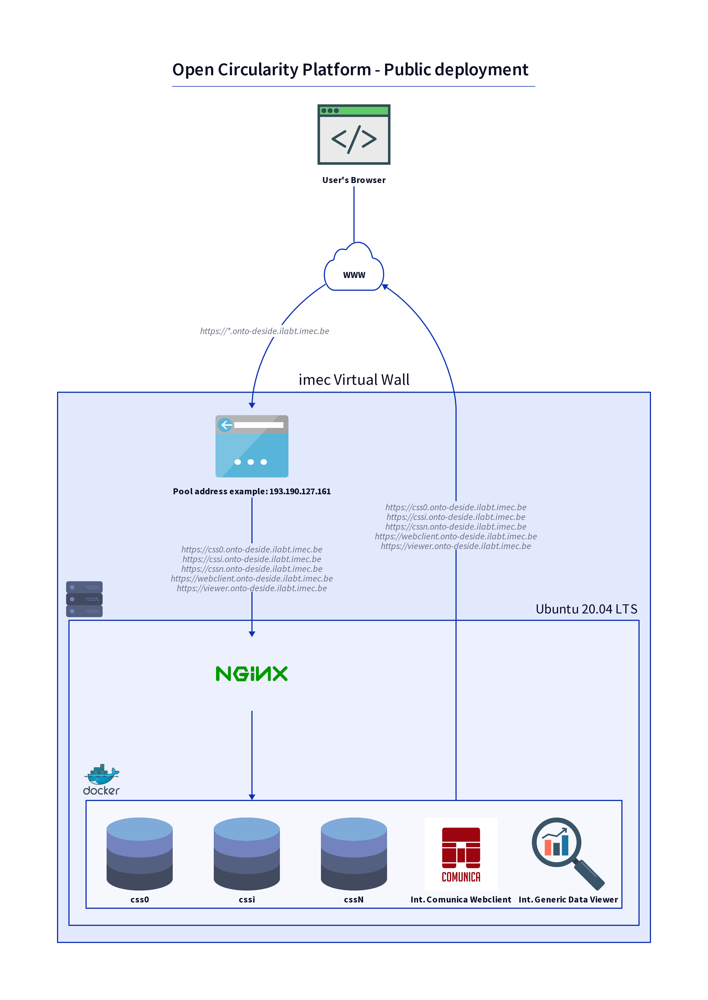
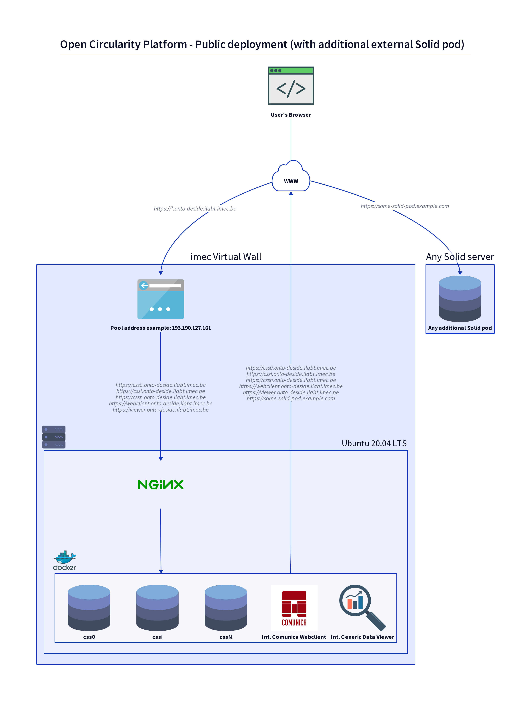
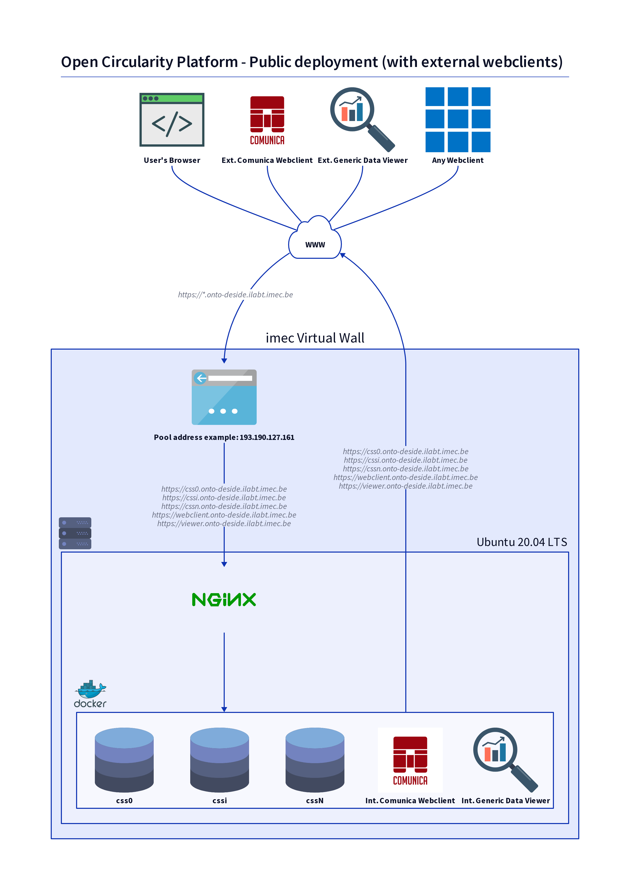
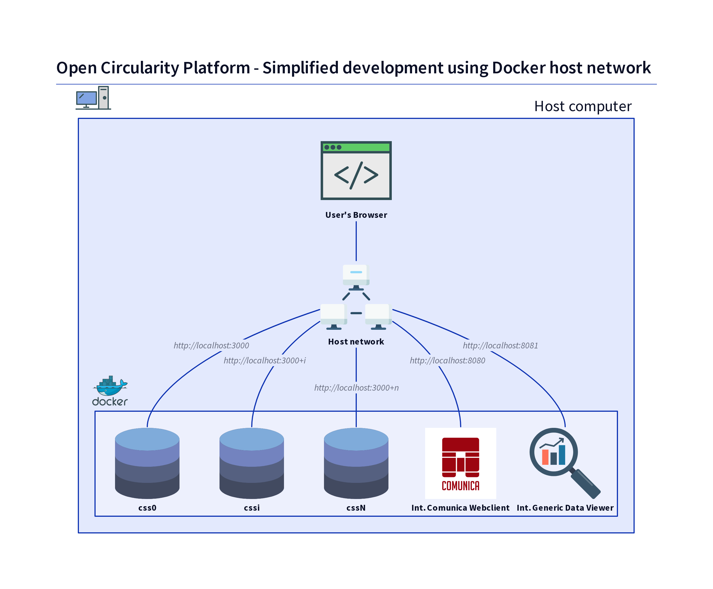
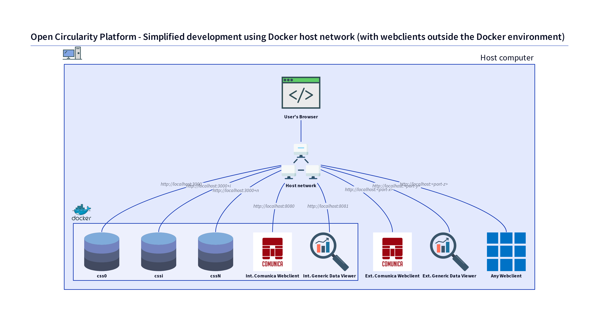

# About the different selected setups

<!-- TOC -->
* [Development and stand-alone demo](#development-and-stand-alone-demo)
* [Public deployment](#public-deployment)
  * [Public deployment with additional external Solid pods](#public-deployment-with-additional-external-solid-pods)
  * [Public deployment with external webclients](#public-deployment-with-external-webclients)
* [Simplified development using Docker host network](#simplified-development-using-docker-host-network)
<!-- TOC -->

## Development and stand-alone demo

In this setup, a Docker environment runs on a host computer.

Each Solid pod and each webclient is located in its own container in the Docker environment
and is addressable with a convenient URL, shown in the picture.

These URLs are valid in the Docker network, but can't be used from the host computer.
- Containers can address each other using these URLs.
- To access the included webclients, a browser must be located inside the Docker environment too.
  The [Firefox container for Docker](https://github.com/jlesage/docker-firefox) fulfills this role.
  This browser's display can be viewed from the user's browser via host port 5800.

Since the Solid pods require the HTTPS protocol, we need SSL certificates.
Each container is provisioned with a self-signed certificate.

## Public deployment

In this setup, a Docker environment runs on a publicly accessible server, for example a node on imec's Virtual Wall running Ubuntu.
- In the Virtual wall example, an *address pool resource* gives the node a public IPv4 address.

DNS is set up to route all subdomains of `onto-deside.ilabt.imec.be` to the public IPv4 address.

Each Solid pod and each webclient is located in its own container in the Docker environment
and is addressable with the same convenient URL as in the [Development and stand-alone demo](#development-and-stand-alone-demo) case above.

This time, however, the URLs are *public*: a Nginx webserver acts as a *proxy server* and makes sure the requests to the public URLs reach the appropriate containers.
- Containers can address each other using these public URLs; requests are passed via the proxy server.
- The user's browser can access the included webclients directly, using their public URLs.

The proxy server is configured to use SSL certificates for all involved HTTPS URLs.
As these URLs are public now, we make use of [Let's Encrypt](https://letsencrypt.org/) to create and manage these certificates.

### Public deployment with additional external Solid pods

The public deployment setup is compatible with additional external Solid pods that can be added for example to contain an additional manufacturer's data.
The included webclients can address an external Solid pod using its public URL (`https://some-solid-pod.example.com` in the picture).

### Public deployment with external webclients

The public deployment setup is not necessarily limited to the included webclients.
External instances of the Comunica webclient or the data viewer, or any other (web)client can access the Solid pods too, using their public URLs.

## Simplified development using Docker host network

This final setup is an attempt to strip down the [Development and stand-alone demo](#development-and-stand-alone-demo) in order to ease local development.
- All Docker containers can be addressed at `http://localhost:<some-port>`.
- No SSL certificates involved.

> This setup uses the *Docker host network mode*, which unfortunately [is available on Linux hosts only](https://docs.docker.com/network/network-tutorial-host/#prerequisites).

The next picture illustrates easier local development, in case one wants to further develop the Comunica webclient or the data viewer, or any other (web)client:
these can be started on the host, outside the Docker environment, using a free host network port.

