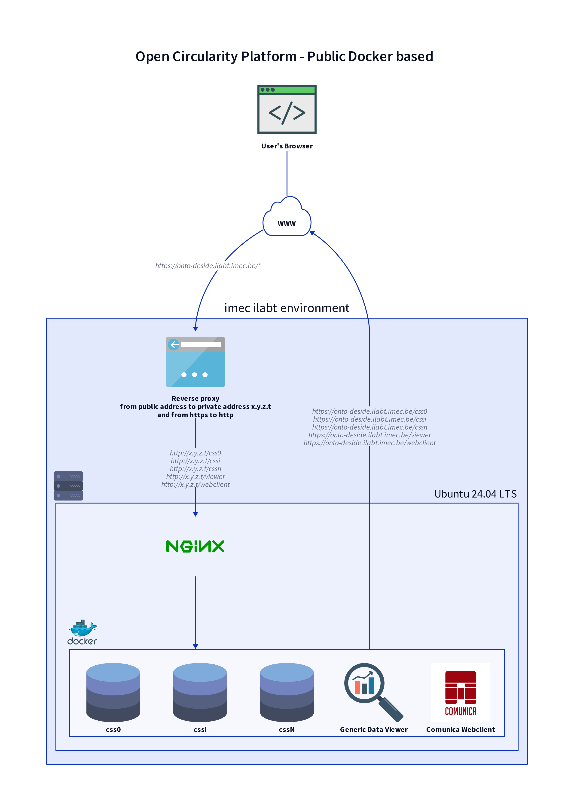
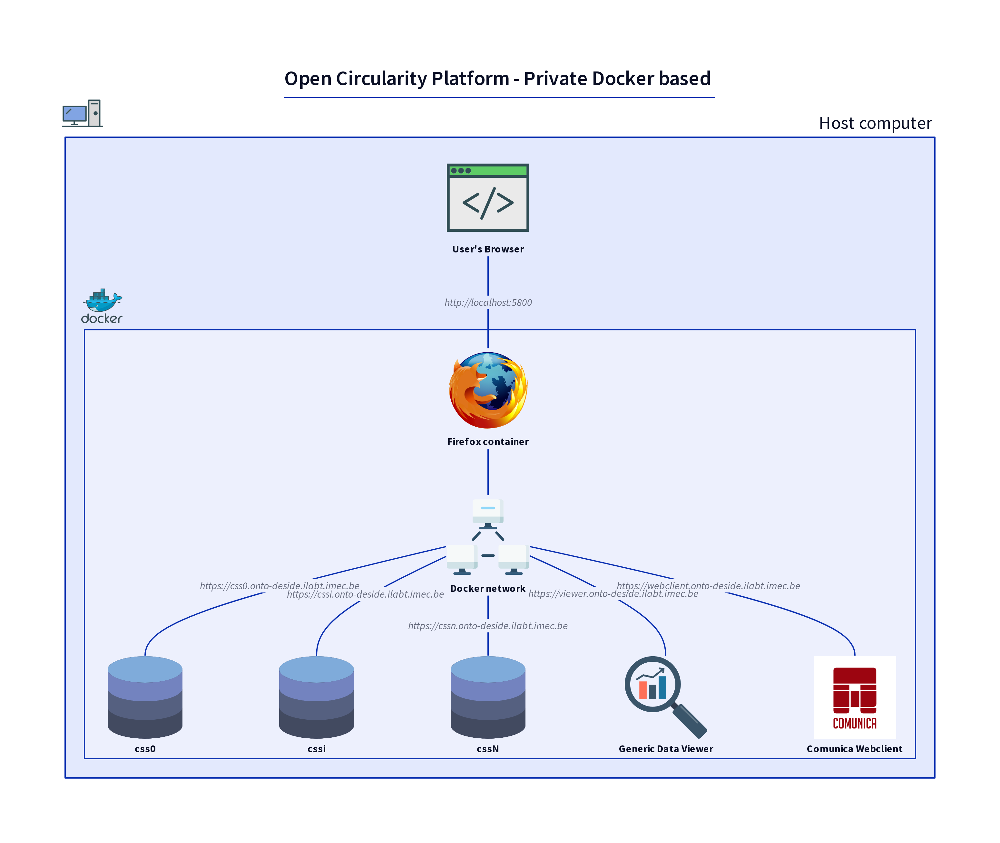

# About the different setup cases

* [Localhost](#localhost)
* [Public Docker based](#public-docker-based)
* [Private Docker based](#private-docker-based)

## Localhost

This is the entry level setup. It is intended for development and local experiments.

* No Docker compose network, no Docker containers.
* CSS's can be addressed at `http://localhost:<port>`.
* HTTP protocol, no SSL certificates.
* A predefined Generic Data Viewer.

## Public Docker based

This is the final setup. It is intended to show project results to an external audience.

* CSS's and predefined webclients are all located in their own Docker container, inside a Docker compose network.
* CSS's and predefined webclients all have convenient *public* URLs.
* HTTPS protocol, official SSL certificates, created and maintained with [Let's Encrypt](https://letsencrypt.org/).
* Predefined Generic Data Viewer and Comunica Webclient.

In this setup, a Docker environment runs on a publicly accessible server, for example a node on imec's Virtual Wall running Ubuntu.

In the Virtual Wall example,

* an *address pool resource* gives the node a public IPv4 address;
* DNS is set up to route all subdomains of `onto-deside.ilabt.imec.be` to the public IPv4 address;
* a Nginx webserver acts as a *proxy server* and makes sure the requests to the public URLs reach the appropriate containers via port mappings, configured in the Docker compose setup;
* containers can address each other using these public URLs; requests are passed via the proxy server;
* the user's browser can access the included webclients directly, using their public URLs;
* the proxy server is configured to use the SSL certificates for all involved HTTPS URLs.

[This image](img/ocp-public-docker-with-additional-pod.png)
illustrates that the public Docker based setup is compatible with additional external Solid pods that can be added for example to contain an additional manufacturer's data.
The included webclients can address an external Solid pod using its public URL (`https://some-solid-pod.example.com` in the picture).

[This image](img/ocp-public-docker-with-ext-clients.png)
illustrates that the public Docker based setup is not necessarily limited to the included webclients.
External instances of the the Generic Data Viewer or Comunica Webclient, or any other (web)client can access the Solid pods too, using their public URLs.

## Private Docker based

This auxiliary setup case is meant to run and test a Docker environment (comparable to the one in the [public Docker based](#public-docker-based) setup case) on a local machine.

* CSS's and predefined webclients are all located in their own Docker container, inside a Docker compose network.
* CSS's and predefined webclients all have URLs identical to the ones in the [public Docker based](#public-docker-based) setup case. **Note these URLS are not public in this case!**
* HTTPS protocol, self-signed SSL certificates, generated using [OpenSSL](https://www.openssl.org/source/).
* Predefined Generic Data Viewer and Comunica Webclient.
* An additional [Firefox container for Docker](https://github.com/jlesage/docker-firefox) is needed to access all other containers, because their URLs are only valid inside the Docker network.
  This browser's display can be viewed from the user's browser via host port 5800.
