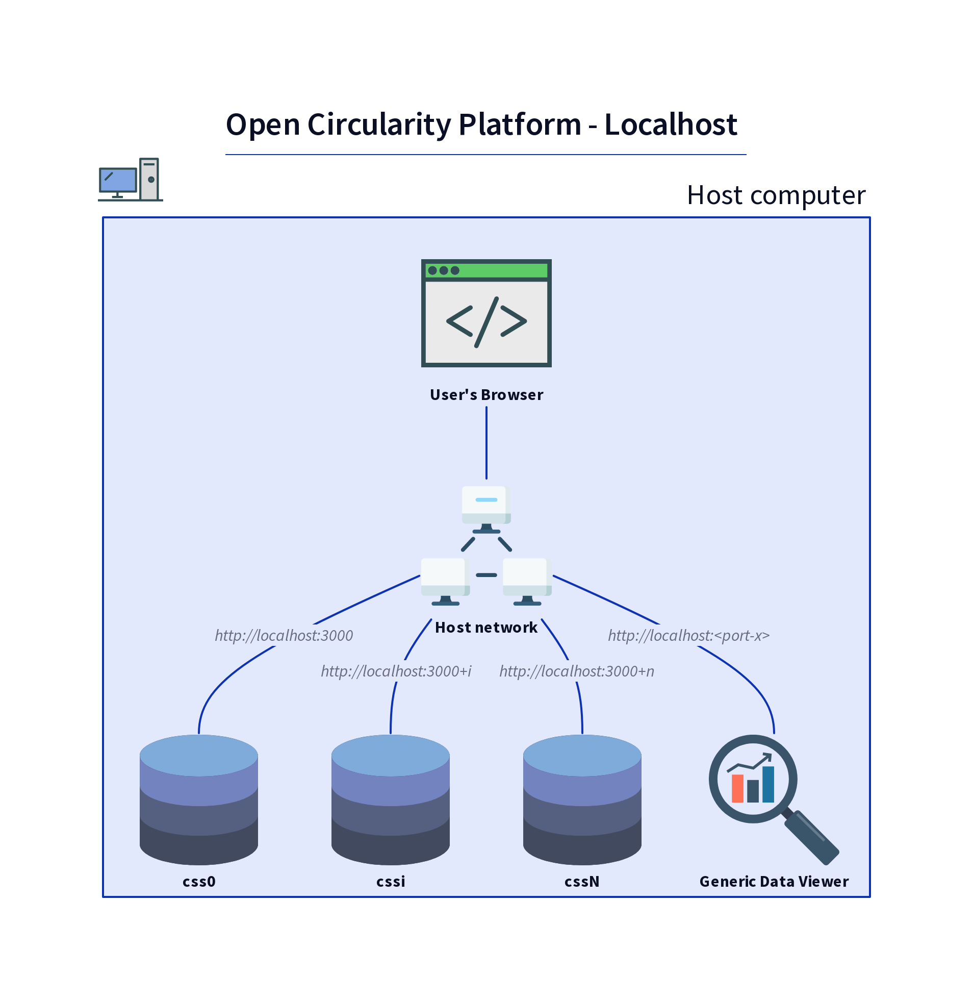

# About the different setup cases

* [Localhost](#localhost)
* [Public Docker based](#public-docker-based)

## Localhost

This is the entry level setup. It is intended for development and local experiments.

* No Docker compose network, no Docker containers.
* CSS's can be addressed at `http://localhost:<port>`.
* HTTP protocol, no SSL certificates.
* A predefined Generic Data Viewer.

## Public Docker based

This is the final setup. It is intended to show project results to an external audience.

* CSS's and predefined webclients are all located in their own Docker container, inside a Docker compose network.
* CSS's and predefined webclients can all be addressed by the external world using convenient *public* URLs.
* HTTPS protocol and official SSL certificates are all handled by a reverse proxy (maintained in imec's ilabt environment).
* Traffic from this reverse proxy to a dedicated (private) server is HTTP.
* Predefined Generic Data Viewer and Comunica Webclient.

In this setup, a Docker environment runs on a private, dedicated server provided by imec's ilabt environment.

[This image](img/ocp-public-docker-with-additional-pod.png)
illustrates that the public Docker based setup is compatible with additional external Solid pods that can be added for example to contain an additional manufacturer's data.
The included webclients can address an external Solid pod using its public URL (`https://some-solid-pod.example.com` in the picture).

[This image](img/ocp-public-docker-with-ext-clients.png)
illustrates that the public Docker based setup is not necessarily limited to the included webclients.
External instances of the the Generic Data Viewer or Comunica Webclient, or any other (web)client can access the Solid pods too, using their public URLs.
