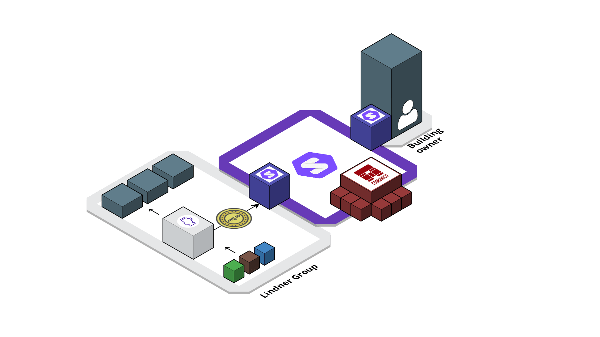

# Use case: Construction

The use case is as follows:

A building owner owns some buildings.
Floors in a building are covered with floor tiles, delivered by a manufacturer,
who uses materials to construct the tiles.
At some time in a building’s lifetime, the building owner refurbishes a building
and wants to decide on what to do with the floor tiles, based on economic and
environmental costs.

## Implementation

We map the source data to Linked Data using the [YARRRML parser][yarrrml-parser]
and the [RMLMapper][rmlmapper].
As a result, every actor's source data will be transformed to RDF, serialized as Turtle.

Every actors has their a pod, hosted by their own [Community Solid server][css].
Each pod contains the Turtle files of the actor owning the pod. 
To operate on the Solid pods (e.g. specifying access control),
we use of [Bashlib][bashlib]: a Command-Line Interface to interact with actors in a Solid. 
To query the distributed data, we use the [Comunica Webclient][comunica-webclient]:
a jQuery widget to query heterogeneous interfaces using Comunica SPARQL.

<!-- Refs -->
[comunica-webclient]: https://github.com/comunica/jQuery-Widget.js
[css]: https://github.com/CommunitySolidServer/CommunitySolidServer
[bashlib]: https://github.com/SolidLabResearch/Bashlib
[rmlmapper]: https://github.com/RMLio/rmlmapper-java
[yarrrml-parser]: https://github.com/RMLio/yarrrml-parser/tree/development/lib