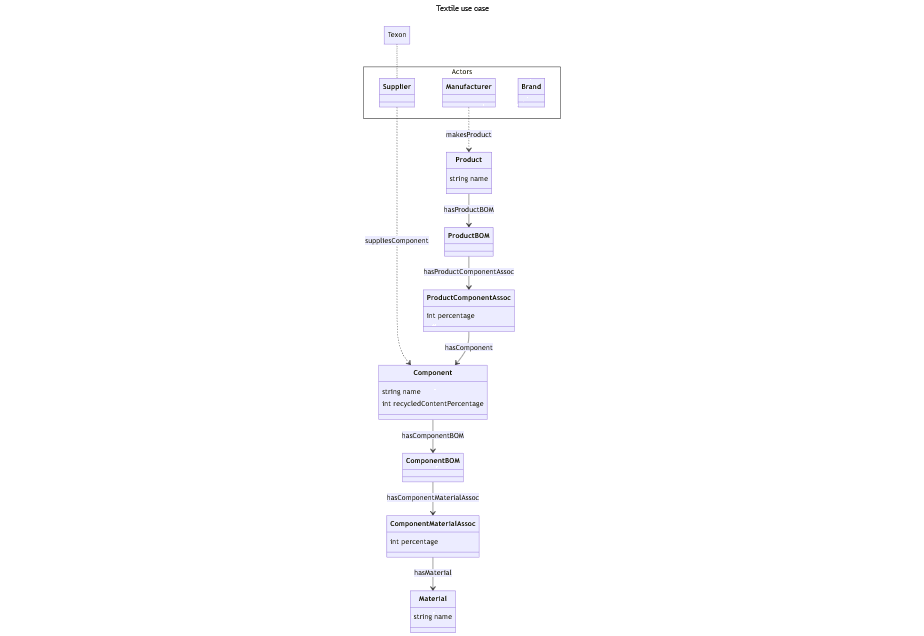

# Use case: Textile

This use case is about three actors:
- a supplier (*Texon* in this example)
- a *manufacturer*
- a *brand*

Texon supplies *components*.
A component consists of *materials*, each making up a certain *(weight) percentage of the component*.
Texon documents the *(weight) percentage of recycled material in a component*.

Manufacturer makes textile *products*.
A product consists of components, each making up a certain *(weight) percentage of the product*.

Brand buys products from Manufacturer.

## Access

In addition to all actors having full access to their own data:

*Brand* can read from Manufacturer's data:
- the products (Product)
- the composition of components in a product (ProductBOM, ProductComponentAssoc)

*Brand* can read from Texon's data:
- the components (Component)

*Manufacturer* can read from Texon's data:
- the components (Component)

An additional actor, *admin*, has read access to all data.

## Queries

By *Texon*:
- Query Texon's components and their materials
- What is the average recycled content (weight percentage) of Texon's components?

By *Manufacturer*:
- Query Manufacturer's products and their components
- What is the average recycled content (weight percentage) of Manufacturer's products?

By *Brand*::
- Query Manufacturer's products
- What is the recycled content (weight percentage) of product p01?

